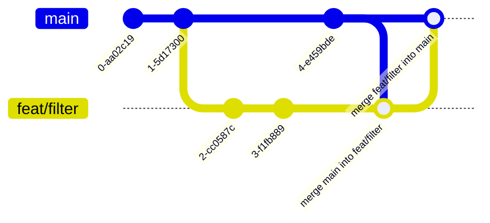

# Contributing Guide

This document shows you how to get started contributing to this project.

## Submitting changes

- Fork the repository.
    - Click on the fork button. 
    - Validate the fork creation. 
- Clone your fork by **HTTPS** or **SSH** method (as you prefer).
  ```shell
  # With HTTPS method
  https://github.com/MyName/template.git
  
  # With SSH method
  git clone git@github.com:MyName/template.git
  ```
  
- Check out a new branch based and name it to what you intend to do:
  > Use one branch per fix / feature
    - Example:
      ```shell
      git checkout -b feat/BRANCH_NAME
      git checkout -b fix/BRANCH_NAME
      ```
- Commit your changes
    - Please provide a git message that explains what you've done.
    - Please make sure your commits follow the [conventions](https://www.conventionalcommits.org/).
    - Commit to the remote repository.
    - Example:
      ```shell
      git commit -am 'feat(plugin): add a commit message'
      ```

      ```mermaid
        gitGraph
            commit
            commit
            branch feat/filter
            commit
            commit
            checkout main
            commit
            commit
      ```

- Push your changes to your fork.
    - Example:
      ```shell
      git push origin BRANCH_NAME
      ```

- Make a pull request **when you are done with your changes**. 
    - Make sure you send the PR to the `main` branch.
        - **title** should follow the same convention as your commits.
        - **description** should follow the template (if exists) or be as descriptive as
          possible. 
    - [GitHub Actions](https://docs.github.com/en/actions) are watching you!

If you follow these instructions, your PR will land pretty safely in the main repository!


